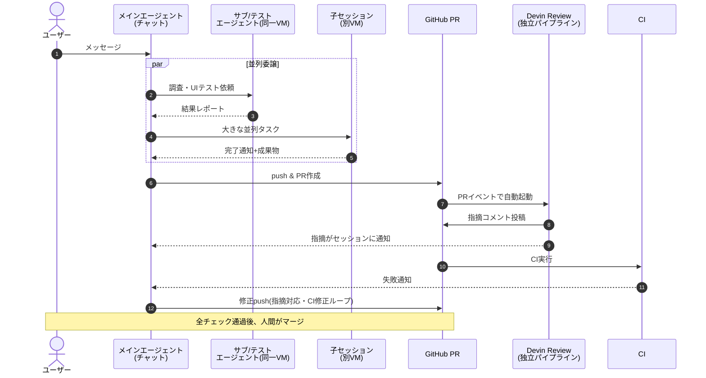

# Devinのエージェント連鎖

Devinセッションで実際に動くエージェント/実行体と、その連鎖の流れ。
2026-09-24時点の調査メモ。

## 登場するエージェント

| 名前 | 役割 |
|---|---|
| メインエージェント | チャットを受けるセッション本体。VM上でコード編集・shell・PR作成まで行う |
| サブエージェント | メインが同一VM内にspawnする下請け（フォアグラウンド/バックグラウンド）。完了時に報告だけ返る |
| テストエージェント | サブエージェントの常設版。UI駆動テストと画面録画専門。ユーザー対話・git書き込み権限なし |
| 子セッション | 独立した完全なDevin（別VM）。並列タスクやワークフロー向け |
| Devin Review | セッション外の独立パイプライン。PRイベントで起動し、指摘をPRコメントとして投稿 |

※ 自動でPRをマージする「受理エージェント」は存在しない。マージは人間（またはGitHubのauto-merge設定）が行う。

## シーケンス図

## 注釈

- **このリポジトリはCI(GitHub Actions)をまだ導入していない。** 図の `GH->>CI` → `CI-->>M` の部分は、`.github/workflows/ci.yml` を置いた場合の一般的な流れ。現状はDevinセッション内で `typecheck`/`lint`/`test`/`build` を手動実行している（AGENTS.mdの「コミット前に必須」参照）
- **Devin Reviewが組織設定で有効な場合のみ**、図の `GH->>R` 以降が動く。無効ならレビュー指摘のループも存在しない
- サブ/テストエージェントはメインエージェントが必要に応じて呼ぶ使い捨て/常駐の手足。セッション内に常時存在するわけではない
